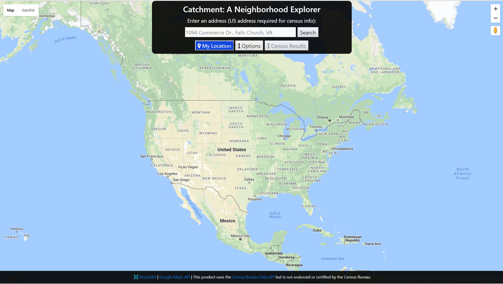
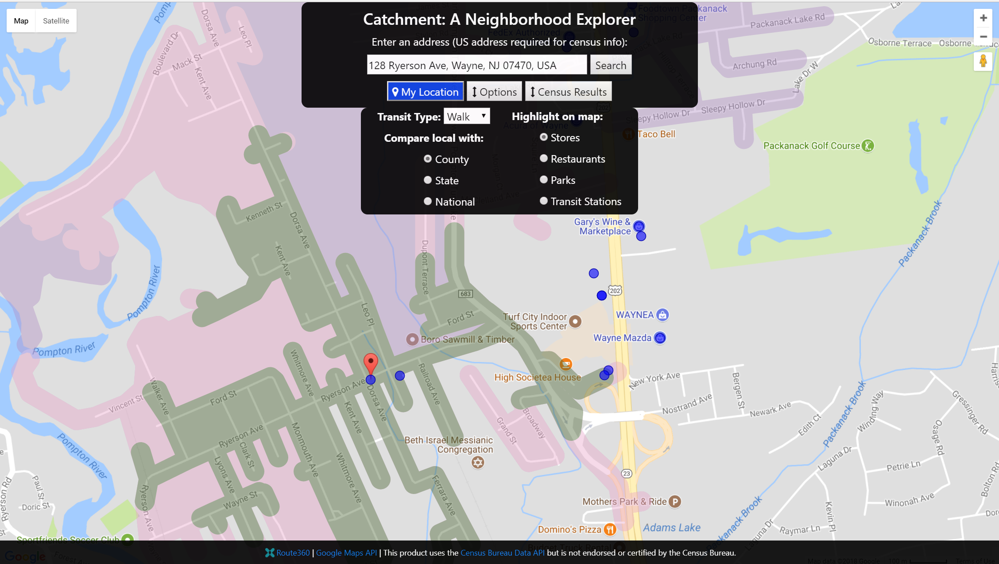
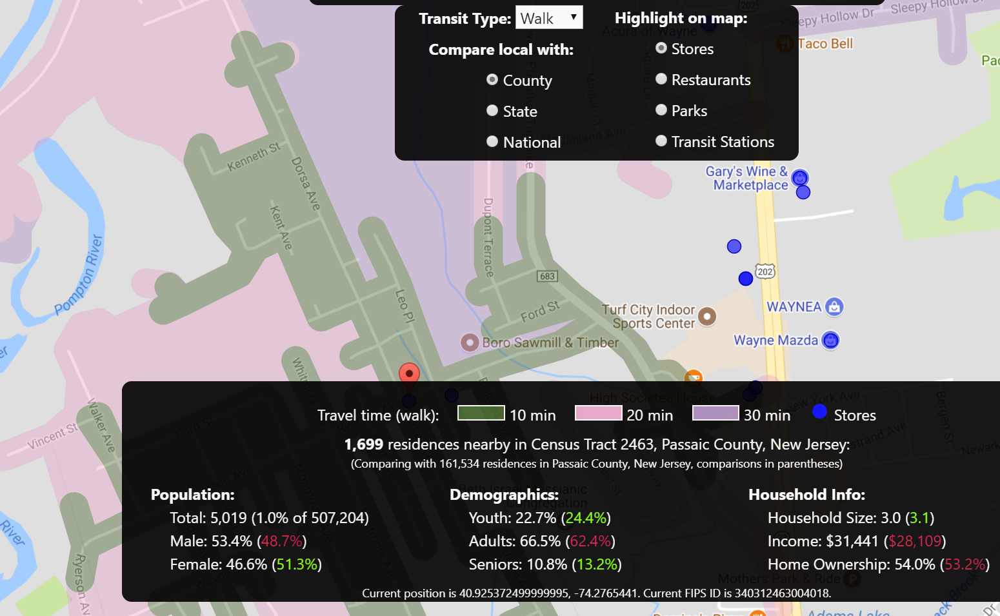

# Catchment
A neighborhood browser app layering map info and local census data.

## Motivation

Unless you have a specific destination in mind, sometimes it's hard to get a clear picture of who and what is around you. This is especially important when searching for a new home, but maybe you have an evening free during business travel and want to see if there's a park or some shops in easy walking distance. Maybe you want to see if a neighborhood has a lot of kids, or plenty of seniors to provide company for an aging parent. Catchment seeks to provide this kind of information in an intuitive format.

## Screenshots
Landing Page:

Options Available:

Search Results:

## Built With

### Front-End
* HTML
* CSS
* Bootstrap

### Back-End
* JQuery
* Javascript
* Node

## Features

* Choose travel type (pedestrian, bike, car, or transit) to see how far you can travel in 10, 20, or 30 minutes
* Highlight stores, restaurants, parks, and transit hubs in the catchment area
* See nearby demographics- household size, ages, and income - and compare to county, state, and national data 
* Drag and drop the marker to see what else is nearby

## Demo

- [Live Demo](https://catchment.herokuapp.com/)

## Authors

* **Jeff Woleslagle** - Design and development
